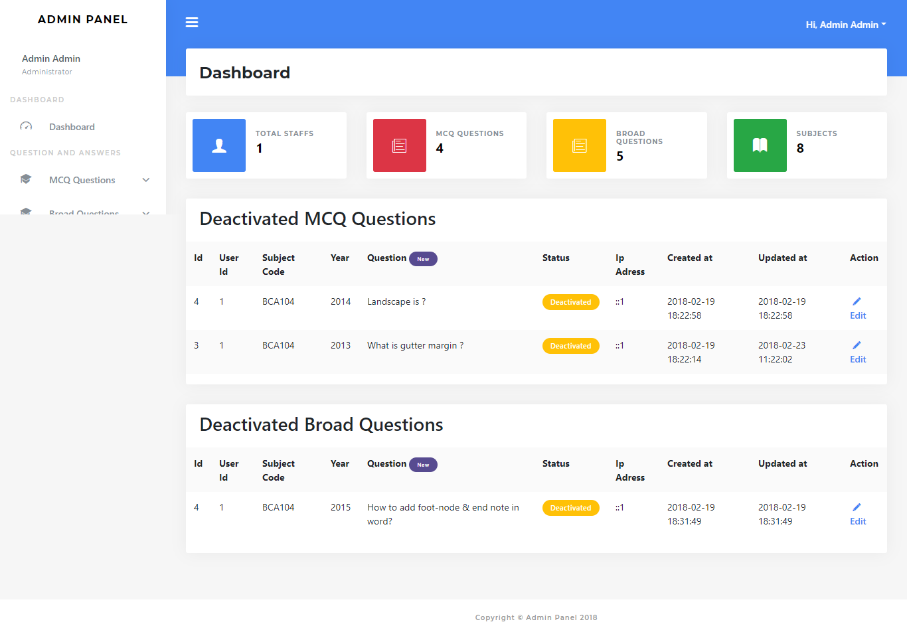

# admin-panel-using-laravel

It's an admin panel. In this admin panel you can add and manage question answers as well as existing user. there are two type of users have admin and agent

------------------------------------------------

framework used: laravel 4.2

language : php

database is in DATABSE folder.

database name admin_panel

------------------------------------------------

# Screenshots

Home page

------------------------------------------------
admin

ID: admin@gmail.com

pass: admin1234

------------------------------------------------
staff

Id: staff@gmail.com

pass: staff1234

*** only gmail id ***
